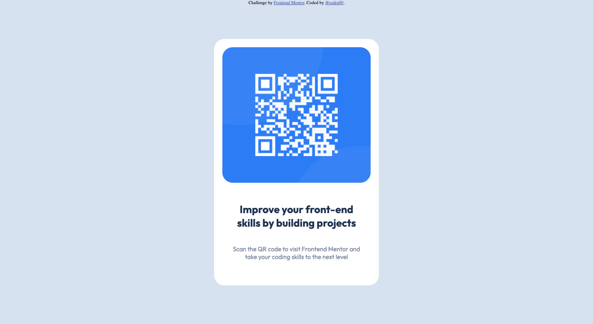

# Frontend Mentor - QR code component solution

This is a solution to the [QR code component challenge on Frontend Mentor](https://www.frontendmentor.io/challenges/qr-code-component-iux_sIO_H). Frontend Mentor challenges help you improve your coding skills by building realistic projects.

## Table of contents

-    [Overview](#overview)
     -    [Screenshot](#screenshot)
     -    [Links](#links)
-    [My process](#my-process)
     -    [Built with](#built-with)
     -    [What I learned](#what-i-learned)
     -    [Continued development](#continued-development)
-    [Author](#author)

**Note: Delete this note and update the table of contents based on what sections you keep.**

## Overview

### Screenshot

Screenshot of my solution

### Links

-    Solution URL: [Add solution URL here](https://your-solution-url.com)
-    Live Site URL: [Add live site URL here](https://your-live-site-url.com)

## My process

### Built with

-    Semantic HTML5 markup
-    CSS custom properties
-    Flexbox

### What I learned

### Continued development

Add media queries, adjust sizes and proportions

## Author

-    Website - [Add your name here](https://www.your-site.com)
-    Frontend Mentor - [@esdra00](https://www.frontendmentor.io/profile/esdra00)
-    Github - [@esdra00](https://github.com/esdra00)
